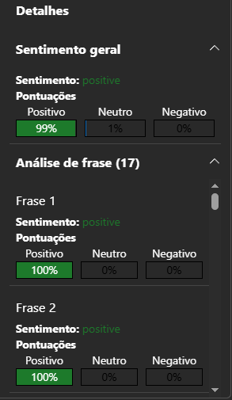
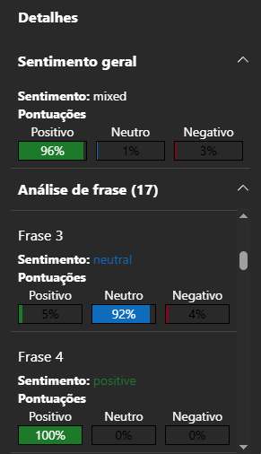
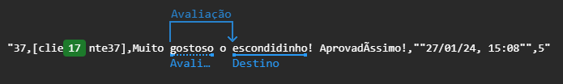

# Análise de Sentimentos com Azure AI Language Studio

### Objetivos do Projeto 

- Desenvolvido como parte do _bootcamp_ **Randstand - Análise de Dados/DIO** para o uso de ferramentas _Azure Speech Studio_ e
   _Azure Language Studio_ para análise de fala e linguagem natural. 

- Aplicadas técnicas no Processamento de linguagem natural (PLN) para identificar e classificar sentimentos em textos com recursos de inteligência artificial na nuvem através da plataforma MS Azure.

### Tecnologias e Ferramentas Utilizadas


--- 

### Estudo de Caso: Duo Gourmet Delivery

```

Para aproximar o projeto de um cenário real, utilizei um conjunto de 303 avaliações coletadas no Duo Gourmet Delivery. Essas avaliações foram extraídas da base de dados do dashboard (dados devidamente anonimizados) e representam feedbacks genuínos de clientes sobre qualidade, atendimento e tempo de entrega. Após extração, tratamento e limpeza, foram identificados 84 avaliações com comentários válidos, que compõem a amostra utilizada.

```
 
---

### Etapas do Processo   

1. **Coleta**: As páginas de avaliações foram salvas manualmente no formato `.html` e armazenadas em `data/html_paginas`.  
      
      ``` Para garantir que os comentários estivessem presentes no HTML, o conteúdo foi copiado diretamente do elemento <article> no DevTools (HTML renderizado). ```    

2. **Extração**: O script `extrair_avaliacoes_v4.py` percorre todos os arquivos HTML e extrai:
   - Nome do cliente (anonimizado para `[cliente1]`, `[cliente2]`…)
   - Nota (estrelas)
   - Comentário (somente se houver texto)
   - Data da avaliação
3. **Limpeza**:
   - Remoção de avaliações sem comentário
   - Remoção de caracteres inválidos (`?` no lugar de emojis)
   - Padronização de espaços e quebras de linha
4. **Geração do dataset**: O resultado é salvo em `data/avaliacoes_duo_gourmet.csv`, pronto para análise no Azure Language Studio.

<br>
  
   >⚠️ Os arquivos HTML originais não foram incluídos no repositório por questões de **privacidade** e para manter o **projeto leve**. O script pode ser reutilizado com qualquer conjunto de páginas salvas em `.html`.

</br>

---

### Dependências

1. `pandas` — _manipulação de dados_
2. `beautifulsoup4` — _extração de conteúdo HTML_
3. `lxml` — _parser rápido para HTML/XML_

---

### Relatório Final: Análise de Sentimentos 


O resultado do estudo e utilização da ferramenta se mostrou promissor. Uma vez que a análise preliminar nos mostrava uma média de avaliações positivas devido à nota da loja (4,97). É válido apontar que a ferramenta analisou 34 frases no total nos arquivos _avaliacoes_duo_gourmet1_ e _avaliacoes_duo_gourmet2_, contendo 42 e 44 elementos com o cabeçalho, respectivamente. 
 

Nessa release v1.0 o projeto entrega um **pipeline de extração do zero, com parsing de HTML, limpeza e anonimização dos dados sensíveis;** tudo isso sendo executado em um **script.py lendo arquivos salvos no diretório _html_paginas_ que entrega um arquivo.csv** ao final (divididos em 2 devido a limitação de caracteres da ferramenta do Azure) para análise de feedback dos clientes do delivery Duo Gourmet. 

O projeto abre margem para projeções futuras. Como por exemplo, para um próximo release é interessante testar uma nova disposição dos elementos nos arquivos a fim de otimizar e abranger mais a amostragem extraída em HTML possibilitando insights avançados através de novas visualizações e criação de dashboards.  

<br/>

>Resultados das análises:

  
| Output referente ao arquivo: [avaliacoes_duo_gourmet1](data/avaliacoes_duo_gourmet1.csv)

<br/>

  
| Output referente ao arquivo: [avaliacoes_duo_gourmet2](data/avaliacoes_duo_gourmet2.csv)

<br/>

  
| Técnica _Opinion Mining_

<br/>
---


### Referências

1. [Guia de Markdown no GitHub](https://docs.github.com/pt/get-started/writing-on-github/getting-started-with-writing-and-formatting-on-github/basic-writing-and-formatting-syntax)
2. [Documentação do Azure AI Language Studio](https://learn.microsoft.com/pt-br/azure/ai-services/language-service/)
3. [Documentação do Azure Speech Studio](https://learn.microsoft.com/pt-br/azure/ai-services/speech-service/)